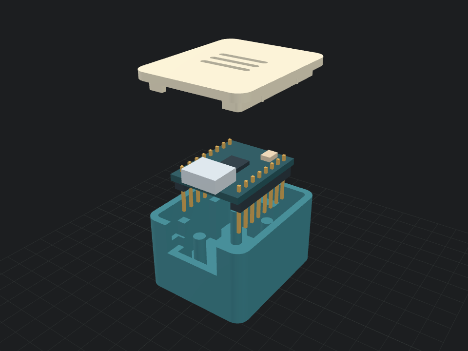

# ESP32-C3 SuperMini enclosure, prototype 01

Two-piece enclosure for a board with two soldered male headers facing downward.
Outer dimensions: **26.4 × 32 × 20.2 mm**. All model dimensions are millimetres.

- `base.stl` and `lid.stl`: separate printable parts, each placed flat at Z = 0.
- `enclosure.step`: assembled enclosure with separate base and lid solids.
- `model.py`: editable CadQuery source; change dimensions near the top.
- `verification.json`: geometry checks from the latest export.
- `model.json`: parts, installed transforms, measurements and animation data for
  the shared viewer. Case height stays 20.2 mm during disassembly; PCB dimensions
  exclude headers and USB. Hide the lid under **Hiển thị**.
- The ZIP contains an offline `index.html` that opens directly in a
  WebGL-capable browser.

The board outline is assumed to be 18 × 22.5 mm, with 1.6 mm PCB thickness.
The [board manual](https://www.makerguides.com/wp-content/uploads/2025/04/ESP32-C3-SuperMini-Manual.pdf)
lists an approximately 18 × 22.52 mm board and 15.24 mm spacing between header rows.
The 0.25 mm end clearance accommodates that nominal length difference.
Header plastic plus pins are modelled as extending 8.5 mm below the PCB;
the case reserves 10 mm. Dupont sockets, upward-facing pins and GPIO cable exits
are outside this prototype's fit assumptions. Remove the lid to access BOOT/RESET.

Wall, floor and lid thickness are 1.8 mm. The USB opening is 14 × 7.4 mm.
The lid has 0.20 mm skirt clearance per side and four ribs with 0.08 mm local
interference. Print fit depends on the printer and material; adjust `FIT` or the
rib dimensions after a test. The board rests on posts with lateral stops;
it is not screwed down or clamped vertically. Component positions are approximate.

Regenerate and verify: `uv run --python 3.12 --with cadquery==2.8.0 --with trimesh==5.1.1 python model.py`

Both parts are designed to print in their exported orientations. Physical fit and
printing have not been tested; inspect the sliced layers before printing.

Viewer dùng [app chung](../#model/esp32-c3-supermini). `model.json` khai báo chi tiết, số đo và animation theo [schema](../model.schema.json). ZIP có `index.html` để xem offline. Chạy `uv run ../build.py` để kiểm tra dữ liệu và đóng gói lại.
